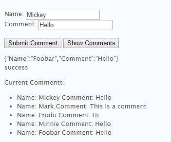

# Lab5-MongoComments

CS260 Mongo Lab

Many social media applications allow users to insert comments. In this lab, you will configure a MongoDB database and connect it to your node.js web server. 

Create a jquery application to display entries from the database and allow users to enter new comments. Your output should look something like this:

------

----

When you click the "submit button", fill in a div with the JSON string you will send to the POST interface of your REST service. 
When the REST service returns, fill in the next div with "success". 
When the user clicks "show comments", contact the GET interface of your REST service and retrieve all of the comments currently in the database and print them in an unordered list.

These [hints](https://github.com/BYUCS260/Lab5-MongoComments/wiki/Hints!) may be helpful as your implement your node/mongodb application.

Once you've implemented getting and adding comments, you should add the ability for users to delete all the comments with 1 button. 
The mongoose Object.find().remove(function(){}) chain might be helpful with this.

Grading:

- Grading will be based off the following (subject to change):

<strong>Behavior</strong> |	<strong>Points</strong>
--- | ---
The GET interface for your REST service returns all current comments | 25
You can pass the POST interface for your REST service a new comment and it correctly inserts it. | 25
Your front-end works as described above | 25
Users can delete all comments. | 15
Your code is correctly up to date on github, and your frontend page looks really good. This is subjective, so wow us.	 | 10
